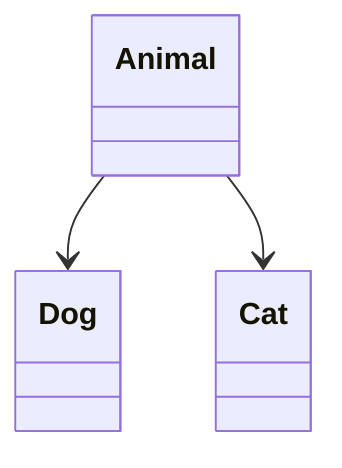
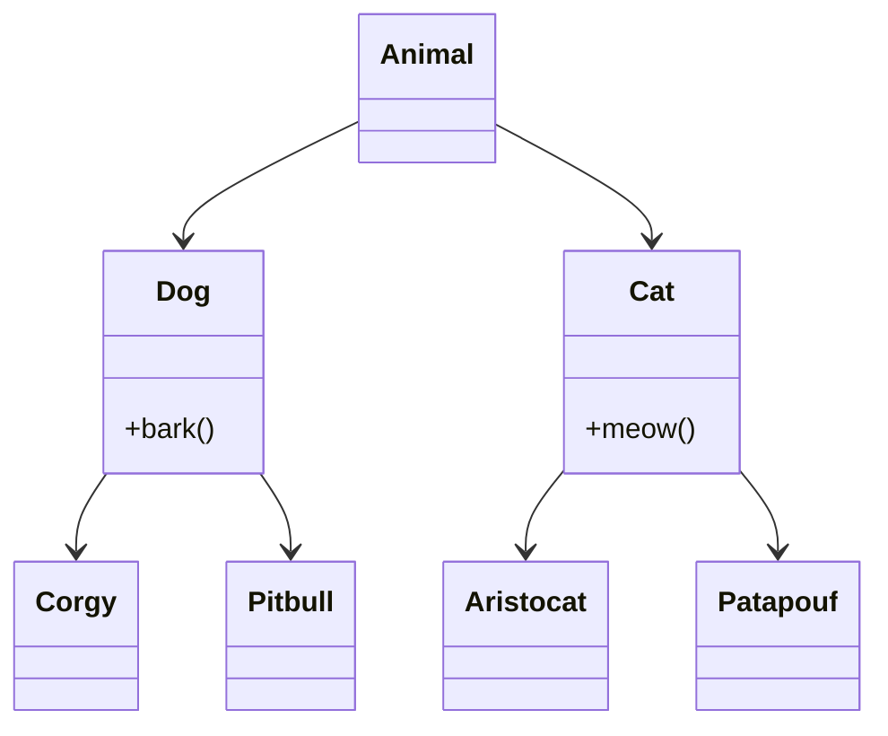
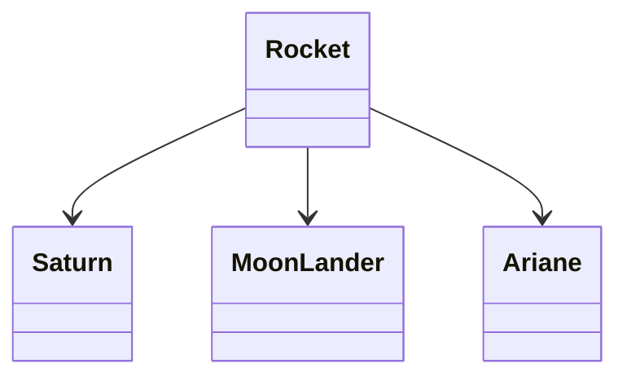
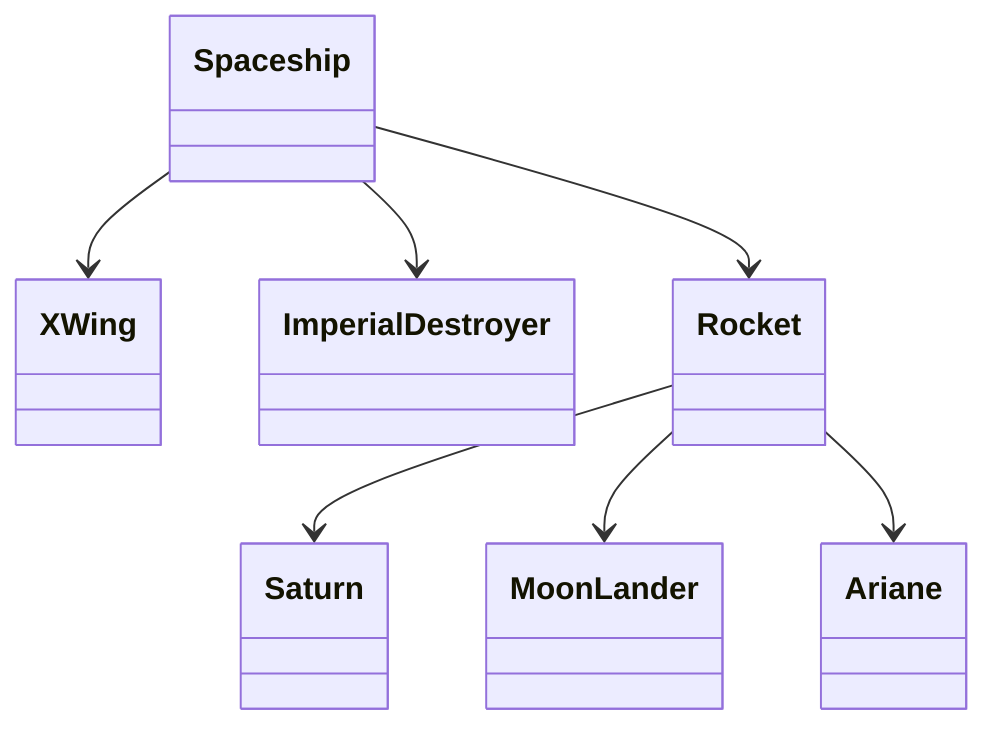

# Object Oriented Programming (OOP) in Python

This is an introduction to OOP in Python. The reader is assumed to be familiar with functional programming in Python, but there are no pre-requisites in terms of object oriented programming.

<!-- toc -->

  * [Requirements](#requirements)
  * [An alternative programming paradigm](#an-alternative-programming-paradigm)
    + [OOP in the standard library](#oop-in-the-standard-library)
- [Fundamentals](#fundamentals)
  * [A first look at a custom class](#a-first-look-at-a-custom-class)
  * [Essential dunder methods](#essential-dunder-methods)
    + [imitate a dictionnary](#imitate-a-dictionnary)
    + [Imitate a function](#imitate-a-function)
    + [A practical example](#a-practical-example)
  * [@property](#property)
- [Inheritance (subclassing)](#inheritance-subclassing)
  * [Simple inheritance](#simple-inheritance)
    + [Inheritance: syntax](#inheritance-syntax)
    + [1) Augment](#1-augment)
    + [2) Extend (collaborative inheritance with `super()`)](#2-extend-collaborative-inheritance-with-super)
    + [3) Override (shadowing base definitions)](#3-override-shadowing-base-definitions)
  * [Abstract base classes](#abstract-base-classes)
    + [The naive way](#the-naive-way)
    + [The better way](#the-better-way)
  * [why simplifying inheritance relationships to "is-a" is flawed](#why-simplifying-inheritance-relationships-to-is-a-is-flawed)
  * [Runtime type checking (`type`, `isinstance`)](#runtime-type-checking-type-isinstance)
  * [Building on top of an existing hierarchy](#building-on-top-of-an-existing-hierarchy)
  * [Multiple inheritance](#multiple-inheritance)
- [Bonus tracks](#bonus-tracks)
  * [Surprising (and useful) uses of the `class` keyword](#surprising-and-useful-uses-of-the-class-keyword)
    + [dataclasses](#dataclasses)
    + [NamedTuples](#namedtuples)
    + [Enums](#enums)
    + [Custom exceptions](#custom-exceptions)
  * ["selfless" methods (`classmethod`, `staticmethod`)](#selfless-methods-classmethod-staticmethod)
  * [More runtime "type checking" (`hasattr`, `getattr`, `setattr`)](#more-runtime-type-checking-hasattr-getattr-setattr)

<!-- tocstop -->

## Requirements
The examples in this document require Python 3.7 or newer. In rare instances (as indicated), 3.8 might be needed.

If you're using Python >= 3.10, you can remove `from __future__ import annotations` from all examples.

If you're not sure what version you have, run
```
$ python --version
```

No requirements other than the standard library will be needed.

I'll use type-annotations extensively in function signatures. For instance
```python
def say(message: str, repetitions: int) -> None:
    print("\n".join([message for _ in range(repetitions)]))
```
If you're not familiar with this syntax, you may think of thes annotations as glorified comments.
They have no effect at runtime but help convey what types are expected from inputs and outputs.


## An alternative programming paradigm

Object-Oriented Programming is a programming paradigm that can be used instead of, or in complement of functional programming. Some languages are purely functional (C, Fortran), some are purely OOP (Java), but many are multi-paradigm (C++, Python, Rust, ...).

There are many ways to use OOP, and it doesn't work the same in all languages. My goal is to provide an overview of the basics of it in Python. The idea isn't to encourage OOP *over* functional programming, but rather to provide the reader with a new approach to problem solving. It should also help you *reading* other people's code that's using the `class` keyword.

### OOP in the standard library

So what's an object ?
Put simply, objects are variables that support accessing data and functions via the `.` operator.
If you've used `list.append` or `str.lower` before... you've used this syntax !

`pathlib` VS `os.path` is an example of "achieving the same thing with different paradigms". The following blocks accomplish the same result

```python
# os.path
import os

path = os.path.abspath(
    os.path.join(os.path.dirname("this_file.txt"), "this_other_file.md")
)

# pathlib
from pathlib import Path

path = str((Path("this_file.txt").parent / "this_other_file.md").absolute())
```
(not saying any one is better, however I know which one I prefer)

Now, let's see how to implement _new_ object types using the `class` keyword !


# Fundamentals

## A first look at a custom class

In the most common use case, a class can be seen as an *instance factory*. The instance is an object, while the class is a blueprint.

Let's study this toy-model

```python
class OnOffButton:
    def __init__(self, name: str) -> None:
        self.name = name
        self._state: str = "off"
        return

    def switch(self) -> None:
        if self._state == "on":
            self._state = "off"
        else:
            self._state = "on"

    def __repr__(self) -> str:
        return f"OnOffButton {self.name!r} is {self._state}"


# create an instance
button = OnOffButton("Brian")

# play with it
print(button)
button.switch()
print(button)
```

Definitions
- `self` is a special argument that represents the current *instance*
- instance *attributes* are accessed using  `.` (e.g. `self.name` here)
- `def foo(self, ...):` defines an *instance method* (i.e. a function whose first argument is the current instance)
- in Python, there are no *private* attributes (all attributes can be accessed at any point from outside the class). It is however conventional to add a **single** trailing `_` to names (attributes and methods) that are not *meant* to be used outside the class (they are implementation detail, and users shouldn't rely on them being stable), so we'll use the expression "private attributes" somewhate abusesively to refer to them. In our example `_state` is a private attribute. (note that it's *important* to use a **single** trailing underscore https://docs.python.org/3/tutorial/classes.html#private-variables)
- By making `_state` private, we've *encapsulated* this data, and provided a *public interface* for it via the `switch` method.
- an instance *holds data* (attributes) and defines *interfaces* to it (behaviour).
- "magic methods" are special names provided by Python's `object` class (the common ancestor to *all* types in Python) starting and ending with double underscores (sometimes dubbed "dunder" methods). We've used two of them here `__init__` and `__repr__`, and we'll see more in the following section !


## Essential dunder methods

### imitate a dictionnary
ingredients:
- `__setitem__`
- `__getitem__`
- `__contains__`
Let us ignore the existence of `dict` for the sake of the example. We'll use lists and tuples as fundamental data structures, and we'll also create a simple `Pair` data class

```python
from __future__ import annotations


class Pair:
    """
    A simple class holding 2 elements, used to represent keys & values.
    """

    def __init__(self, first, second) -> None:
        self.first = first
        self.second = second


class MyDict:
    def __init__(self) -> None:
        self._data: list[Pair] = []

    def __getitem__(self, key) -> None:
        for pair in self._data:
            if key == pair.first:
                return pair.second

        raise KeyError(key)

    def __setitem__(self, key, value) -> None:
        for pair in self._data:
            if key == pair.first:
                self._data.remove(pair)
                break

        self._data.append(Pair(key, value))


# create an instance
md = MyDict()

# set a key/value pair, and retrieve it !
md["name"] = "Clément"
print(md["name"])
```

### Imitate a function
ingredients:
- `__call__`
```python
import time


class MyCallable:
    def __init__(self, duration) -> None:
        self.duration = duration

    def __call__(self) -> None:
        print("working ...", end="", flush=True)
        time.sleep(self.duration)
        print(" done !")


mc = MyCallable(2)
mc()
```

### A practical example
Implement "telephone number" objects that
- support `str()` (conversion to str) -> `__str__`
- can be compared with the equality operators (`==` and `!=`) (ignoring whitespace) -> `__eq__`
- support `len()` (count the number of *pairs* in a number) -> `__len__`
- have a useful string _representation_ -> `__repr__`

```python
from __future__ import annotations
import re


class TelephoneNumber:
    def __init__(self, data: str, /) -> None:
        # normalize data before storing it
        # '   0011 22  3 3' -> '00 11 22 33'
        data = re.sub(r"\s", "", data)
        self._data = re.sub("..", lambda _: _.group() + " ", data).rstrip()

    def __str__(self) -> str:
        return self._data

    def __eq__(self, other: TelephoneNumber | str) -> bool:
        # reduce to string comparison
        return str(self) == str(other)

    def __repr__(self) -> str:
        # when practical, repr() should return interpretable code
        # that could be used to create an identical instance
        return f"TelephoneNumber({self._data!r})"

    def __len__(self) -> int:
        # count the number of 'pairs', rounded up
        return len(str(self).split())


tn = TelephoneNumber("00112233445")
print(f"{tn = !r}, ({len(tn)=})")
assert TelephoneNumber("0011") == TelephoneNumber(" 0 0 1 1 ")
```

## @property

A property is a method that looks like an attribute from the outside, they are read-only by default

```python
import random


class Secret:
    def __init__(self, min: int, max: int, /) -> None:
        # generate a random int and store it as a private attribute
        self._my_number = random.randint(min, max)

    @property
    def number(self) -> int:
        return self._my_number


secret = Secret(1, 10)
print(secret.number)

# will raise an error, because a property is read-only by default !
secret.number = 22
```

If we want to allow the attribute to be set from outside the class, we can implement a property-setter
```python
@number.setter
def number(self, value: int) -> None:
    self._my_number = value
```

>In many other languages, it is common to provide limited read/write access to private attributes with "getters" and "setter" methods. These patterns are not idiomatic in Python, so I won't cover this pattern here.

Properties are also a convenient way to store data that's expensive to compute, in order to delay acutal computation until it's needed

```python
import time


class Process:
    def __init__(self) -> None:
        self._result: str | None = None

    @property
    def result(self) -> str:
        if self._result is None:
            time.sleep()
            self._result = "404"
        return self._result
```
Try it out in a repl, you'll see that the second time it is called, `process.result` is much faster to retrieve
```pycon
>>> process = Process()
>>> process.result
'404'
>>> process.result
'404'
```

In fact, this pattern is so common that there's a specialized version of the property decorator just for it
```python
import time
from functools import cached_property  # requires Python>=3.8 !


class Process:
    @cached_property
    def result(self) -> str:
        time.sleep()
        return "404"
```

Another reason to use properties is if some attributes are meant to be mutated by the user, and other attributes must be reajusted accordingly
```python
class Rectangle:
    def __init__(self, width: float, height: float) -> None:
        self.width = width
        self.height = height

    @property
    def area(self) -> float:
        # computed upon request, so it's never out-of-sync with
        # attributes it depends on. It's also read-only.
        return self.width * self.height


rect = Rectangle(1, 2)
print(rect.area)

rect.width *= 10
print(rect.area)
```


# Inheritance (subclassing)

> Disclaimer: inheritance in very much language-specific, it works very differently in Python and C++ for instance. However the basic principles are the same.

Inheritance is a powerful mechanism to allow code to be reused. It's also an extremely efficient footgun. I want to cover the basics, but bare in mind that it should be used with caution.
https://hynek.me/articles/python-subclassing-redux/

## Simple inheritance

> inheritance encapsulates a "is-a" relationship between object types.

(this is a flawed simplification, as we'll see later, but it's useful to get started)

This means that inheritance enables hierachical object classification (we'll abusively refer to this as taxonomy)

### Inheritance: syntax

Say we want to model different animals, including dogs. A dog *is an* animal, so it makes sense to represent the type hierarchy as



Here's how we'd express this hierarchy in Python

```python
class Animal:
    pass


class Dog(Animal):
    pass


class Cat(Animal):
    pass
```

We say that
- `Dog` inherits from `Animal`
- `Animal` is a parent class to `Dog`
- `Animal` is a base class to `Dog`
- `Dog` is a child class to `Animal`

> Child classes inherit all methods and attributes of their parent.

`Animal` can be used to define everything (data and behaviour) that is common to cats and dogs.
So now let's see the 3 main strategies that we can use (and combine).

### 1) Augment
We can _augment_ the base class by defining completely new behaviours !
```python
class Animal:
    def __init__(self) -> None:
        print("This is an animal.")

    def walk(self):
        print("walking !")


class Dog(Animal):
    def sit(self) -> None:
        print("sitting !")

    def play_dead(self) -> None:
        print("playing dead !")
```


### 2) Extend (collaborative inheritance with `super()`)
`super()` is a builtin function that, put simply, allows a class to *pass the ball* to its parent. We can use this to *extend* the parent class' functionality

```python
class Animal:
    def __init__(self) -> None:
        print("This is an animal.")


class Dog(Animal):
    def __init__(self) -> None:
        super().__init__()
        print("This animal is a dog.")


Dog()
```

### 3) Override (shadowing base definitions)
We can also choose to *override* any definitions from the parent class.
```python
class Animal:
    def __init__(self) -> None:
        print("This is an animal.")


class Dog(Animal):
    def __init__(self) -> None:
        print("This animal is a dog.")


Dog()
```

>At this point let's reflect on how inheritance can deteriorate maintainability:
> - reading a child class' body isn't sufficient to learn everything about the class
> - deep class hierarchies can make answer simple questions like "where is this method defined ?" difficult to answer.

But if we're going to get great responsibilities, we might as well use our great powers ?

## Abstract base classes
An abstract class defines some interface but doesn't implement it completely. It leaves some crucial details to be implemented by subclasses.

### The naive way

An easy way to declare methods without actually implementing them is to replace their code with `raise NotImplementedError`

```python
class A:
    def __init__(self, data) -> None:
        self.data = data

    def process_data(self) -> int:
        raise NotImplementedError("process_data isn't implemented in class A !")


class B(A):
    def process_data(self) -> int:
        return len(self.data)
```

This is bad because
- `A` can be  instanciated (`A()` doesn't raise an error), despite the fact that it cannot produce functional instances
- if B doesn't implement all abstract methods (we make a typo, or add a new abstract method to the parent class and forget to update B), then its instances won't be functional either

> any error will be discovered at runtime, possibly long after it's been made, and possibly by someone who has no idea how the code works. Clearly this isn't ideal.

### The better way

Use the `abc` module (abc stands for "**AB**stract **C**lass")
```python
from abc import ABC, abstractmethod


class A(ABC):
    def __init__(self, data) -> None:
        self.data = data

    @abstractmethod
    def process_data(self) -> int:
        pass


class B(A):
    def process_data(self) -> int:
        return len(self.data)
```

- A, and any class that inherits from it without implemented all of its `@abstractmethod` won't be able to create instances (an error will be raised). This is a _lot_ better than in our first approach where a `NotImplementedError` would be raised only when certain methods would be called...

## why simplifying inheritance relationships to "is-a" is flawed

> Is a square also a rectangle ? Geometrically, yes, but a more *useful* question to ask is whether a square can be used everywhere a rectangle can ([Liskov substitution principle](https://en.wikipedia.org/wiki/Liskov_substitution_principle)), and the answer is no ! (rectangles have more degrees of freedom than squares)

"squares as a special case of rectangles" is an actual example of inheritance relationship in many training courses. Let's see why it's bad.

Taking again the example from a couple sections back
```python
class Rectangle:
    def __init__(self, width: float, height: float) -> None:
        self.width = width
        self.height = height

    @property
    def area(self) -> float:
        # computed upon request, so it's never out-of-sync with
        # attributes it depends on !
        return self.width * self.height


rect = Rectangle(1, 2)
print(rect.area)

rect.width *= 10
print(rect.area)
```
It was fundamentally assumed in this example that `rect.width` could be manipulated independently from `rect.height`, but what should happen when the same is done to an object of class square ? We could specify that height is silently updated alongside width (and vice versa), *or we could throw an error* and say that the only `size` attribute can be updated from outside
```python
class Square(Rectangle):
    def __init__(self, size: float) -> None:
        self.size = size

    @property
    def height(self) -> float:
        return self.size

    @property
    def width(self) -> float:
        return self.size
```

In this approach *a square could not be used everywhere a rectangle can*, so we'd have to use conditionals:
```python
if isinstance(rect, Square):
    rect.size *= 10
else:
    rect.width *= 10
```

The Liskov substitution principle (**LSP**) is a sanity principle that helps keeping code sane and easy to *reason about* (which in a sense, was the whole point of OOP). In short, it states that type B may inherit from type A if and only if an instance of `B` can be used in place of an instance of `A`.
Proving your program doesn't violate this principle goes beyond just class definitions (user code should also be written in a substitution friendly fashion), and Python won't ever force it on you (Python is sometimes described as a language for "consenting adults"), but baring this principle in mind during the design stage of your code can save inordinates ammounts of time you'd otherwise loose debugging it.


## Runtime type checking (`type`, `isinstance`)


Consider the following hierarchy


An object's class (type) can be inspected at runtime using the builtin `type` function
```pycon
>>> x = B()
>>> print(type(x))
<class '__main__.B'>
```

This is useful if you need to match *exact* types (most commonly, in test code)
```python
if type(x) is Corgy or type(x) is Pitbull:
    x.bark()
elif type(x) is Aristocat or type(x) is Patapouf:
    x.meow()
else:
    raise TypeError(f"Got x with unexpected type {type(x)}")
```

You may prefer to use `isinstance` for concision (*this isn't strictly equivalent as we'll see later*)
```python
if isinstance(x, (Corgy, Pitbull)):
    x.bark()
elif isinstance(x, (Aristocat, Patapouf)):
    x.meow()
else:
    raise TypeError(f"Got x with unexpected type {type(x)}")
```

However, if the code is following LSP, we can simplify further by checking membership to base classes instead

```python
if isinstance(x, Dog):
    x.bark()
elif isinstance(x, Cat):
    x.meow()
else:
    raise TypeError(f"Got x with unexpected type {type(x)}")
```

This is simpler, and future-proof: now you can add new subclasses of `Cat` and `Dog` without needing to revisit this block.

`isinstance` , also a built-in function, will check wether its first argument is of any type in the second argument, *or of any subtype of it*.

Ultimately, we may observe that `Cat.meow()` and `Dog.bark()` are identical in usage and have the same signature, so can get simplify our code by adding a `Animal.cry()` method to replace the redundant ones

```python
if isinstance(x, Animal):
    x.cry()
else:
    raise TypeError(f"Got x with unexpected type {type(x)} (expected an Animal)")
```


## Building on top of an existing hierarchy



Add upper (abstract ?) layers to avoid code duplication !




... beware of *overdesign* https://vtk.org/doc/nightly/html/structglobal.html


## Multiple inheritance

Multiple inheritance is a vast topic in itself, and an even more powerful footgun (code can very easily degenerate into unmaintainlable [big balls of mud](https://en.wikipedia.org/wiki/Anti-pattern))/

> Sanity principle:
> if your class hierarchy necessitates more than one axis of specialization, think again.

We'll still cover one simple use case for mutliple inheritance: child classes can be marked as abstract too !

```python
from abc import ABC, abstractmethod


class Vehicle(ABC):
    @abstractmethod
    def move(self):
        pass


class Car(Vehicle, ABC):
    def move(self):
        print("rolling !")

    @abstractmethod
    def fill_tank(self):
        pass
```


# Bonus tracks
## Surprising (and useful) uses of the `class` keyword

### dataclasses
(requires Python >= 3.8)
`dataclasses` elimitates a lot of boilerplate code for classes that are all about storing data
```python
from dataclasses import dataclass


@dataclass
class IntPair:
    first: int
    second: int
```
Try it out in a repl !
```pycon
>>> p = IntPair(1, 2)
>>> p
IntPair(first=1, second=2)
>>> p == IntPair(1, 2)
True
```
we got a useful `__init__`,  `__repr__` and `__eq__` for free !
There are a lot of subtle things you can do with dataclasses, that I won't demonstrate here, but if what I just showed is all you care about, it is simpler to go for ...

### NamedTuples
simpler than dataclasses (also less flexible)

```python
from typing import NamedTuple


class IntPair(NamedTuple):
    first: int
    second: int
```

a `NamedTuple` functions essentially as a raw `dataclass`, but as `tuple` subtypes, they are also immutable, and support unpacking.


### Enums

```python
from enum import Enum, auto


class State(Enum):
    ON = auto()
    OFF = auto()
```
(using `enum.auto` here because I don't need specific values, I just want them to be different)

### Custom exceptions
This is the idiomatic way to create new error types
https://docs.python.org/3/library/exceptions.html#Exception
```python
class ImSorryDave(Exception):
    """Raised when Dave's commands cannot be executed, but he can."""
```
(note that in 99% cases, builtin exception types are sufficient to cover your needs and should be prefered.)


## "selfless" methods (`classmethod`, `staticmethod`)
Sometimes, we don't need to refer to the current instance (`self`) in a method, and instead want to refer the class itself instead. To illustrate this let's introduce a class with attributes of its own.

```python
class InstanceCounter:
    """This class retains the number of its instances that were created"""

    _counter = 0

    def __init__(self):
        self.__class__._counter += 1
```
How do we retrieve the value of `_counter` while respecting the class' privacy ?
We could implement an instance method as
```python
def get_current_count(self) -> int:
    return self.__class__._counter
```
But this requires... an instance ! what if instead we want to be able to write this ?
```python
InstanceCounter.get_current_count()
```
(yes, classes are objects too (🤯 ))

Here's how we'd do it !
```python
@classmethod
def get_current_count(cls) -> int:
    return cls._counter
```

In some cases, we might alsovnot need to refer to the current instance *or* the current class.
We could just use an instance method or a class method and leave the first argument alone, but there's a better way to express the intent:

```python
@staticmethod
def _parse(s: str) -> str:
    return s.strip()
```
but wait, if this method doesn't know about instances *or* the class, *why* should it be in the class at all, couldn't this be a good ol' function ? Often, `@staticmethod` is used to decorate functions that don't make sense outside the class, and are private helper functions. It's just one more tool to organize your code freely and with clear declaration of intent.

## More runtime "type checking" (`hasattr`, `getattr`, `setattr`)
> ⚠️ The functions covered here should be approached with caution and avoided as much as possible, as they often hint to LSP-violation. However there are some valid use cases for them such as backward-compatibility, and dark-magic™️.

`hasattr` and `getattr` are builtin methods that check whether an arbitrary object has an attribute with a given name, and access it, respectively. They are sometimes useful to implement dark-magic where attributes must be discovered programatically, as in the following (silly) example
```python
for name in ["furr", "teeth", "claws"]:
    if hasattr(x, name):
        value = getattr(x, name)
    else:
        value = "(none)"
    print(f"x.{name} = {value}")
```
However, using it with hard-coded values should be avoided as it hints to a violation of LSP
(though this may sometimes be necessary for backward compatibility).
```python
if hasattr(x, "furr"):
    value = x.name
else:
    value = "(none)"
print(f"x.furr = {value}")
```

Finally, `setattr` is yet-another builtin function can be utilized to programmatically set attributes by name.
Again, this is rarely the right approach, but it can come in handy sometimes.
